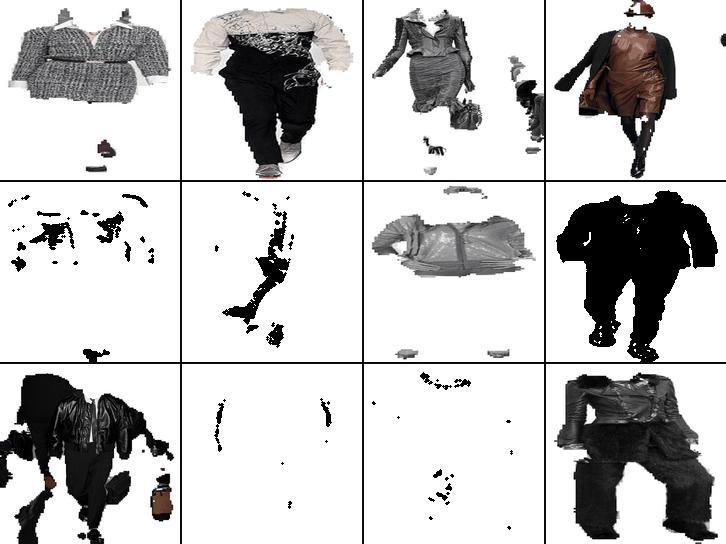
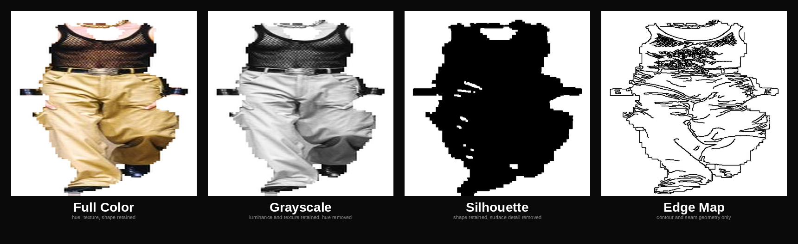

# FASH-iCNN: Making Editorial Fashion Identity Inspectable Through Multimodal Retrieval

<p align="center"></p>

FASH-iCNN is a multimodal system trained on 87,547 Vogue runway images from 15 fashion houses (1991--2024) that makes editorial fashion culture inspectable. Given a photograph of a garment and an optional face input, the system identifies which fashion house produced the garment, which era it belongs to, and which color tradition it reflects. Rather than hiding its cultural reference frame, the system grounds every recommendation in specific retrievable runway precedents so that users can see not just what the system predicts but which houses, editors, and historical moments shaped that prediction.

## Visual Abstraction Ladder

A core insight of FASH-iCNN is that designer identity persists even as visual information is stripped away. The system analyzes garments at four levels of abstraction:



<p align="center"></p>

Full color retains hue, texture, and shape. Grayscale removes hue. Silhouette removes surface detail. The edge map retains only contour and seam geometry — yet designer identity remains recognizable.

## Key Results

| Task | Metric | Result |
|------|--------|--------|
| Designer identity (14-way) | Top-1 accuracy | **78.2%** (vs. 9.3% baseline) |
| Decade classification (4-way) | Top-1 accuracy | **88.6%** (vs. 45.2% baseline) |
| Year prediction (34-class) | Top-1 accuracy | **58.3%** (vs. 2.9% baseline) |
| Year prediction | Mean absolute error | **2.2 years** |
| Color pipeline (BK→CSS→LAB) | Perceptual error | **ΔE₀₀ = 9.10** (down from 15.0) |

## Paper

> FASH-iCNN: Making Editorial Fashion Identity Inspectable Through Multimodal Retrieval.

Paper is under review. Citation details will be added upon publication.

## Dataset

This project uses the **Vogue Runway Top-15** dataset:

> [`tonyassi/vogue-runway-top15-512px`](https://huggingface.co/datasets/tonyassi/vogue-runway-top15-512px) on HuggingFace.

87,547 runway images spanning 15 fashion houses from 1991--2024.

## Repository Structure

```
fash-icnn-icmi2026/
├── extraction/               # Clothing crop extraction via SegFormer
├── color_prediction/         # Hierarchical BK→CSS→LAB color pipeline
│   ├── hierarchical_lab/     #   Constrained LAB regression
│   ├── hierarchical_color/   #   BK→CSS hierarchical classification
│   ├── css_clothing/         #   CSS-level color prediction
│   └── clothing_constrained/ #   Per-designer constrained models
├── designer_identity/        # Designer identity from visual abstraction
│   ├── abstraction/          #   4-level abstraction experiment
│   ├── full_designer/        #   Full-crop designer classification
│   └── silhouette_designer/  #   Silhouette-only designer classification
├── temporal_identity/        # Temporal editorial identity
│   ├── decade/               #   Decade classification (4-class)
│   └── year/                 #   Year prediction (34-class)
├── demo/                     # Gradio interactive demo
├── assets/                   # Images and GIFs
│   ├── readme_header.gif     #   Animated grid header (shown above)
│   ├── abstraction_ladder.png#   Static 4-panel figure (shown above)
│   └── abstraction_carousel.gif # Animated carousel of all four levels
└── visualize/                # Visualization scripts
    └── visualize_abstraction.py # Abstraction ladder figure + animated carousel
```

## Running the Demo

```bash
pip install -r requirements.txt
cd demo
python app.py
```

This launches a Gradio web interface where you can upload a garment image and optionally a face image to receive a color recommendation with editorial provenance.

## Regenerating Figures

To regenerate the abstraction ladder image and animated carousel:

```bash
python visualize/visualize_abstraction.py
python visualize/visualize_abstraction.py --image_id chanel_spring_2005_000012
```

This produces `assets/abstraction_ladder.png` (static row) and `assets/abstraction_carousel.gif` (animated). Works headless on compute nodes; opens a live preview window when a display is available.

## Note on Checkpoints

Model checkpoints are **not included** in this repository. To reproduce results, train models using the provided scripts in each experiment folder. Each subfolder's README describes how to run its training pipeline. Training was performed on a single NVIDIA L40S GPU.
